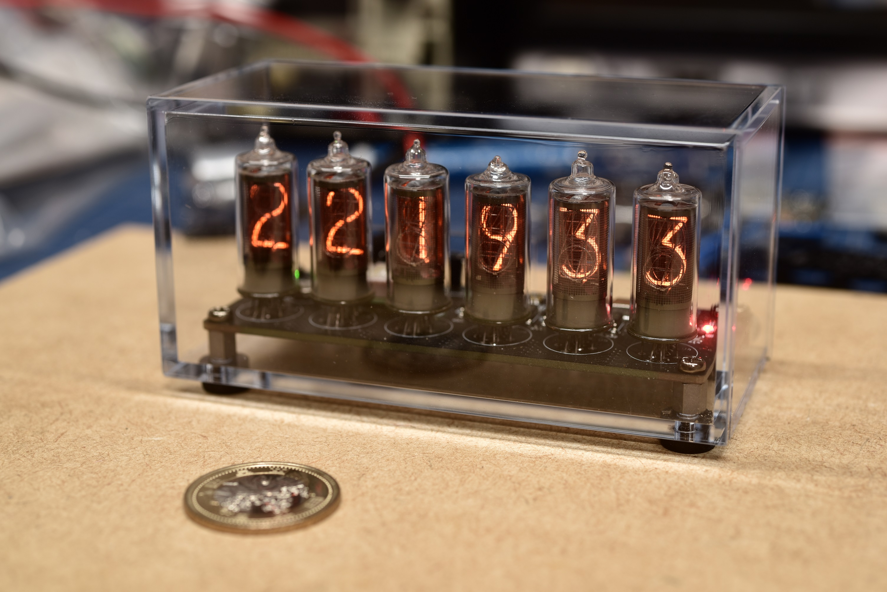

# ニキシー管時計 OENXC-6

6桁ニキシー管時計です。

小型でシンプルでありつつ、ニキシー管を美しく魅せ、かつ実用的な機能を持つ時計を目指しました。

## 特徴

### 主な特徴
- GPSによる自動時刻補正（補正OFF可能）
- 時差補正機能（手動での設定）
- 指定時刻での消灯・点灯
- 周囲の明るさに応じた自動明るさ補正
- 明るさの手動補正
- 1/fゆらぎ表示（レベル可変）
- 数字切り替え方法の変更（フェード、クロスフェード、パタパタ表示、ドットムーヴ）
- ランダム数字表示
- 手動時刻合わせ
- 背面スイッチ(3つ)による設定
- 設定の保存（不揮発）

## 主な仕様

| 項目 | 概要 | 備考 |
|:-----------|:------------|:-------------|
| 点灯方式 | ダイナミック点灯  | アノード側を定電流制御 |
| 所要電源 | USBバスパワー(5V500mA) | 背面のUSB Type-Cコネクタより供給 |
| ニキシー管 | JRC製B-5755 |  |
| 寸法 | 112mm x 60mm x 52mm (W x H x D) | |

### 回路の概要
#### アノード駆動回路
アノード側は定電流制御回路による電流制御とフォトカプラによるON/OFF制御を併用しています。
明るさの制御は定電流制御回路で、表示の切り替えに関する処理はフォトカプラを使用（ダイナミック点灯のデューティを変える）しています。

#### カソード駆動回路
カソード側の駆動回路はトランジスタにより行っています。実装面積の都合からディスクリートのトランジスタを使用しています。プリバイアス電圧は電源回路から取り出しています。

#### マイコン周辺回路
MPUには入手性を考慮してRaspberry Pi Picoにも使用されているRP2040を使用しています。
デバッグ用信号を取り出してデバッガを使えるようにしています。

## 回路図

 - [回路図(PDF)](https://github.com/jp7dki/oenxc-6/blob/main/NixieVI.pdf)

## 使い方

 - [Wiki(github)](https://github.com/jp7dki/oenxc-6/wiki)

## 免責事項
本ページにて公開する資料は全て無保証での提供とさせていただきます。本ページの資料を利用した事による不利益や損害などについて、一切の責任を負いかねます。
